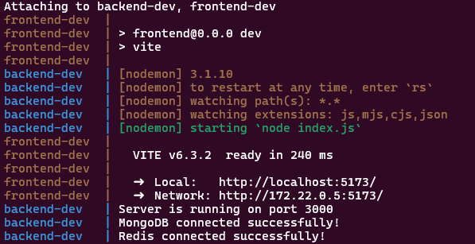
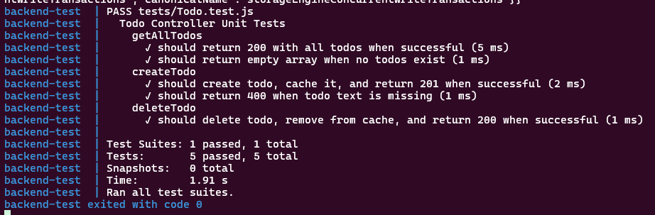
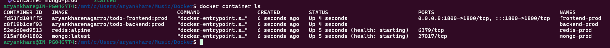
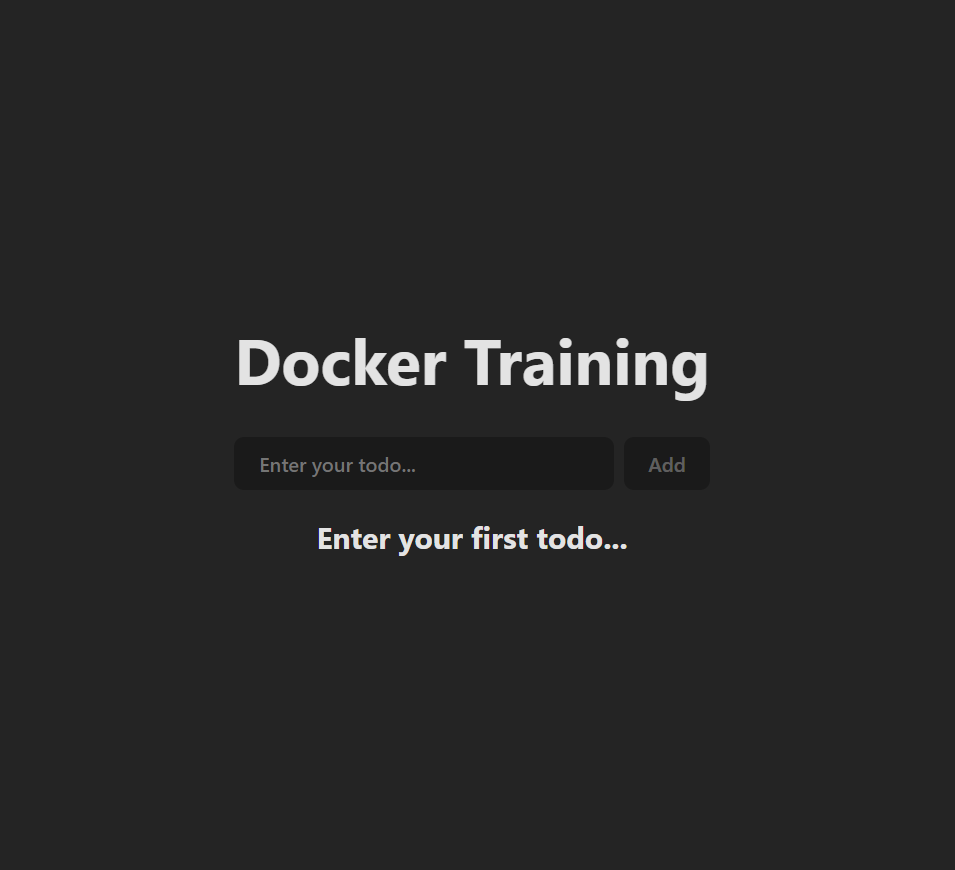
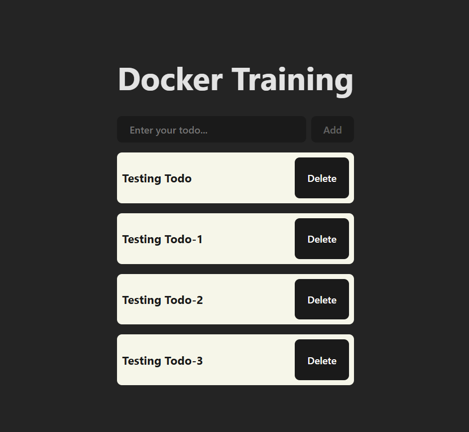

# Dockerized Todo Application
A full-stack Todo application with React (Vite), Node.js backend, MongoDB, and Redis, configured for development, testing, and production environments using Docker.

<br>

# 🚀 Quick Start
* Prerequisites
* Docker Engine (v20.10+)
* Docker Compose (v1.29+)
* Git

<br>

# 🔧 Setup Instructions
- ### Clone the Repository
    ```
        git clone <repository-url>
        cd <project-folder>
    ```
- ### Environment Configuration
    - Rename .env.sample to .env
    - Fill in all required variables (no empty values allowed).

    **`Example .env:`**
    ```
        # ===== BASE CONFIGURATION ===== #

        # Environment Configuration
        ENV=dev

        # Docker Images (common across environments)
        BACKEND_IMAGE_NAME=backend
        FRONTEND_IMAGE_NAME=frontend

        # ===== DEVELOPMENT ===== #
        DEV_BACKEND_PORT=8080
        DEV_MONGO_DB_NAME=todos-dev
        DEV_FRONTEND_PORT=7070

        # ===== PRODUCTION ===== #
        PROD_BACKEND_PORT=3000
        PROD_MONGO_DB_NAME=todos-prod
        PROD_FRONTEND_PORT=5173

        # ===== TESTING ===== #
        TEST_BACKEND_PORT=3001
        TEST_MONGO_DB_NAME=todos-test
    ```

    _⚠️ Critical: Ensure all ports are unique and not used by other applications._

<br>

# 🛠️ Running the Application
### 🧑‍💻 Development Environment

```
    docker compose --env-file .env --profile dev up --build backend-dev frontend-dev
```



### Access Services:

- Frontend: `http://localhost:7070/`
- Backend API: `http://localhost:8080/`

### Key Features:

- Hot-reloading for frontend/backend code.
- Volumes mounted for live code changes.


### 🧪 Testing Environment
```
    docker compose --env-file .env --profile test up --build
```



### Ports:

- Backend: `3001`

### 🚀 Production Environment
```
    docker compose --env-file .env --profile prod up -d
```



📌 Note: The backend and frontend docker image for production environment is being pulled from the DockerHub.
Frontend: `docker pull aryankharenagarro/todo-frontend:prod`
Backend: `docker pull aryankharenagarro/todo-backend:prod`

### Ports:
- Frontend only: `http://localhost:5173/`
- Databases run internally (no host ports exposed).

# 🛑 Stopping Containers
```
    docker compose --profile dev down
```

# 🔍 Debugging Tips
### Check Logs:
```
docker logs backend-dev
```

### Verify Running Containers:
```
    docker ps
```

# Application Running

### Landing page


### Data populated interface


📌 Note: Replace `<repository-url>` and `<project-folder>` with your actual Git repo and directory names.