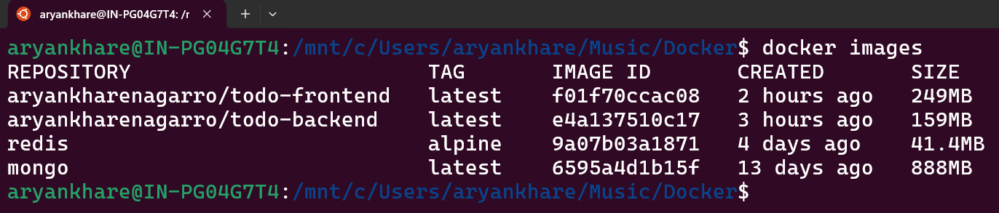

# Docker Training
This training is to gain the practical experience with **Docker** and understand how to manage containerized application and their environment effectively.

## Key Takeaways
- Learn about **Docker Images**.
- Learn about **Docker Containers**.
- How to create **Custom Docker Images**.
- Get practical experience with Docker.
- Run **Multiple Container** application with **Docker Compose**.
- Setup **Custom Networks**.
- How to use _Docker Registry_ i.e. **DockerHub**.

## Todo Application
For this Docker training, I created a **Todo application**, which allows user to manage their tasks through user-friendly interface. User can _add_, _delete_ & _read_ all the todos.

Created sperate _Frontend_ & _Backend_ service for the application. Ensures seamless integration between services through _RESTful APIs_.

## Tech Stack
- **Frontend**: React + Vite
- **Backend**: NodeJS + Express 
- **Database**: MongoDB
- **Cache**: Redis
- **Dependecies**: Mongoose, CORS
- **Docker**: Docker
- **Docker Compose**: Docker-Compose

## Setup Instructions
- ### Pre-requisites
    - docker v20.10 or later
    - docker compose v1.29.0 or later

- ### Repository
    - Clone this repository.
    - [GitHub repo: docker-training](https://github.com/AryanKhare-Nagarro/docker-training)

- ### Run docker-compose
    - Once the repository is clone on local, run **docker-compose**.
    - ```docker-compose up -d```
    - It will pull the _docker images_ from _DockerHub_ and create & run the docker containers for all the docker images in _detach mode_.
    - It pulls 2 custom images of the backend and frontend service from the _DockerHub_
    - Frontend: `aryankharenagarro/todo-frontend:latest`
    - Backend: `aryankharenagarro/todo-backend:latest`

- ### Application is Ready to use
    - Now applicatoin is ready to use.
    - Expose MongoDB on `port: 27017`
    - Expose Redis on `port: 6379`
    - Backend: `http://localhost:3000`
    - Frontend: [http://localhost:5173](http://localhost:5173)

- ### Backend Routes
    - Base URL is mentioned above.
    - `GET /`: Fetch all the todos.
    - `POST /`: Create a new todo.
    - `Delete /`: Delete a specific todo.

## Screenshots
### `docker images`


### `docker container ls`


### Landing Page


### Data Populated Interface


## Managing Docker Contianers
Once the containers are up and running,

- To stop and remove the containers, execute the `docker-compose down` command. Keep in mind, this action will also delete the database data stored within the container.

- To only stop the execution of containers and retain them use `docker-compose stop`. This action will retaint the data in database within the container. 

- To again start a stopped containers, use `docker-compose start`. It will re-start the containers and also fetch the retained data from the database.